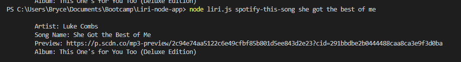
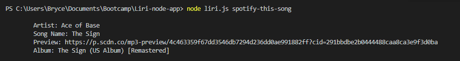
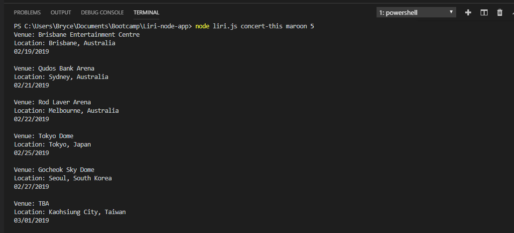
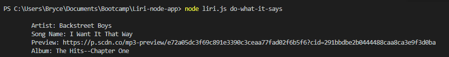

# Liri-node-app

Liri is a command line interface application.  It will accept the commands below and return outputs from various APIs.

Liri will accept the follow commands
* spotify-this-song  song name
* movie-this  movie name
* concert-this  band name
* do-what-it-says

